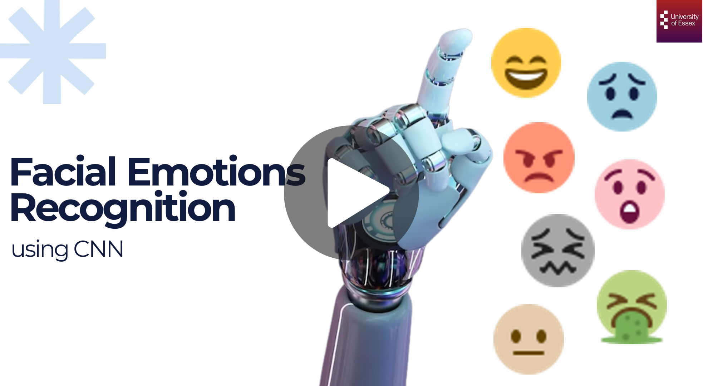
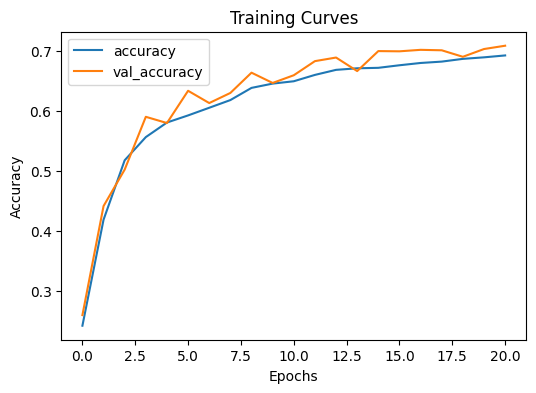
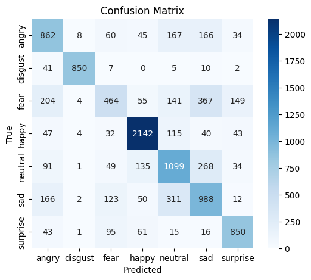

# Human Facial Emotions Recognition using CNN

A deep learning–based facial emotion recognition system that classifies human emotions from facial images using a Convolutional Neural Network (CNN). This project builds a complete and reproducible pipeline from dataset preparation and preprocessing to model training, evaluation, and prediction. 

The model automatically detects facial expressions and classifies them into seven universal emotions:

Angry • Disgust • Fear • Happy • Sad • Surprise • Neutral 

---

## Project Overview

Human emotions play an essential role in communication and decision-making. Enabling machines to understand emotional expressions improves human computer interaction and supports applications such as:

- Mental health monitoring
- Intelligent user interfaces
- Automated customer service
- Behavioral analysis and surveillance
- Affective marketing analytics

This project applies deep learning techniques to automatically learn facial expression patterns from images without manual feature engineering.

---

## Project Documentation 

- [Project Report](emotions_docs/emotions_report.pdf)
- [Project Presentation Slides](emotions_docs/emotions_ppt.pptx)

**Presentation Video**

<a href="https://drive.google.com/file/d/11BQLPYxKmVABNrjyK0LU1gFDWaMpiZuI/view?usp=sharing">
  
</a>

---

## Key Features

- CNN-based emotion classification model
- Dataset fusion for improved diversity and robustness
- Data augmentation to handle class imbalance
- Fully reproducible training pipeline
- Modular and flexible code structure
- Single-image emotion prediction pipeline

---

## Datasets

The model is trained using two publicly available facial emotion datasets from Kaggle. 

**Dataset Download Links**

- <a href="https://www.kaggle.com/datasets/jonathanoheix/face-expression-recognition-dataset" target="_blank">
   <strong>FER (Face Expression Recognition Dataset)</strong> 
  </a> 
 - <a href="https://www.kaggle.com/datasets/apollo2506/facial-recognition-dataset" target="_blank">
   <strong>FER+ (Facial Expression Recognition Plus Dataset)</strong>
   </a>
  
### Dataset Characteristics

<table>
  <thead>
    <tr>
      <th>Dataset</th>
      <th>Samples</th>
      <th>Classes</th>
      <th>Image Size</th>
      <th>Format</th>
    </tr>
  </thead>
  <tbody>
    <tr>
      <td>FER (Face Expression Recognition)</td>
      <td>35,887</td>
      <td>7</td>
      <td>48 × 48</td>
      <td>Grayscale</td>
    </tr>
    <tr>
      <td>FER+ (Facial Expression Recognition Plus)</td>
      <td>35,257</td>
      <td>6</td>
      <td>48 × 48</td>
      <td>Grayscale</td>
    </tr>
  </tbody>
</table>

---

## Data Processing

- Dataset merging and label standardization
- Data augmentation (especially for disgust class)
- Image normalization [0,1]
- Stratified data split:
  - Train: ~70%
  - Validation: ~15%
  - Test: ~15%

---

## Model Architecture 

A custom VGG-style Convolutional Neural Network (CNN) was implemented using TensorFlow/Keras.
Input (48×48×1 grayscale)

```bash
-> Conv Block (64 filters) 
-> Conv Block (128 filters)
-> Conv Block (256 filters)
-> Flatten
-> Dense (256)
-> Softmax Output (7 emotions)
```
---

## Training Techniques

- Batch Normalization
- Dropout Regularization
- Data Augmentation
- AdamW Optimizer
- Early Stopping
- ReduceLROnPlateau Scheduler
- Class Weight Balancing

---

## Results

### Model Performance 

- Test Accuracy: 69.27%
- Weighted F1-score: 0.69

The model performs strongly on distinct expressions (happy, disgust, surprise) while more subtle emotions like fear and sad remain challenging due to visual similarity. 

### Training Performance

The following plot shows training accuracy and validation accuracy across epochs, indicating steady convergence without significant overfitting. 

**Accuracy vs Validation Accuracy**



Observations
- Accuracy improves from approximately 25% -> 70% within 20 epochs.
- The validation curve closely follows the training curve throughout training.
- Learning stabilizes around epoch 15-20, which suggests convergence of the model.

### Confusion Matrix

The confusion matrix illustrates prediction performance across all emotion classes and highlights where misclassifications occur.



Strongly Recognized Emotions
- Happy shows the highest correct predictions (dominant diagonal values).
- Disgust achieves very high precision and recall with minimal confusion.
- Surprise is also consistently classified correctly.

Common Misclassifications
- Fear is frequently confused with Neutral & Sad.
- Sad and Neutral show moderate overlap due to visually similar facial expressions.

Some confusion exists between Angry, Neutral, and Sad, reflecting subtle expression differences. These results highlight a known challenge in facial emotion recognition: certain emotions share overlapping facial features, making separation difficult even for deep learning models.

---

## Prediction Pipeline 

The project includes an inference pipeline that:

- Loads a trained model
- Converts input image to grayscale
- Resizes to 48×48
- Normalizes pixel values

---

### How to Run this Project 

This project was developed and executed using Google Colab, allowing the model to be trained using cloud GPU resources without local installation. Follow the steps below to reproduce the results.

1. Open the Notebook in Google Colab

2. Enable GPU Runtime (Recommended)
In Colab: 
```bash
Runtime -> Change runtime type -> Hardware accelerator -> GPU
```
This significantly speeds up CNN training.

3. Install Required Dependencies

4. Upload Kaggle API Key

The datasets are downloaded directly from Kaggle using the Kaggle API.

- Go to Kaggle -> Account Settings
- Click Create New API Token
- Download kaggle.json

Then upload it inside Colab when prompted:
```bash
from google.colab import files
files.upload()
```
The notebook automatically configures Kaggle access.

5. Download and Prepare Datasets.
6. Run the other cells in Colab. 
